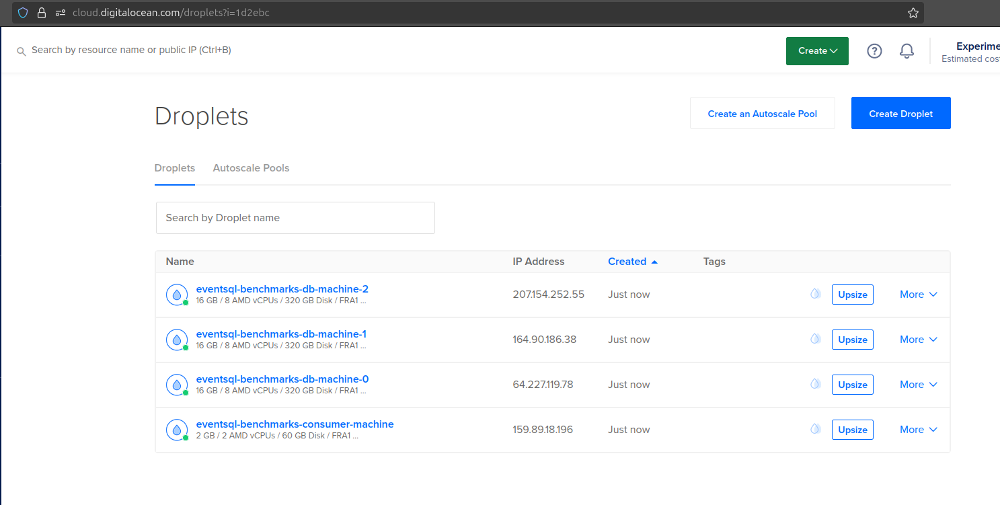

# Benchmarks

If you care only about numbers, you can find them in the results dir.

Some background and details:
* all benchmarks were run on [DigitalOcean](https://www.digitalocean.com/) infrastructure
* benchmarks were run with both single Postgres instance serving as the events backend as well as multiple (sharding)
* we have the following components:
  * `app` - simple Spring Boot that uses *EventSQL* to consume events
  * `runner` - script that uses *EventSQL* to publish events with set per second rate and amount, waits for consumers to finish consumption and gathers relevant stats (it's running benchmarks)
  * `events-db` - Postgres serving as a backend for *EventSQL* - events are published to and consumed from it; 
  depending on the benchmark, it's run in one or a few (3) instances
* most of the setup to run benchmarks is automated and described below; it's fairly straightforward to reproduce

## Infrastructure

Defined in the `prepare_infra.py` script; sometimes resources are limited by `docker run` command, but essentially:
* *benchmarks-app (consumer)* runs on 2 GB and 2 CPUs (AMD) machine
* each *events-db* runs on 16 GB and 8 CPUs (AMD) machine
* each *benchmarks-runner* runs alongside *events-db*
* there is a basic firewall and virtual private network (vpc) setup (`prepare_infra.py`), so that nobody is bothering us during benchmarks

## Requirements

* DigitalOcean account - you might also use a different infrastructure provider but will need to adjust `prepare_infra.py` script accordingly or write your own setup from scratch
* Python 3 & Bash for scripts
* Java 21 + compatible Maven version to build apps
* Docker to dockerize them and run various commands (scripts assume non-root, current user, access)

## Preparation

### Infra

From scripts dir, Python env setup:
```
bash init_python_env.bash
source venv/bin/activate
```

The following might take a while, since we are creating a few machines - one for the consumer app and three for multiple Postgres instances:
```
export DO_API_TOKEN=<your DigitalOcean API key>
export SSH_KEY_FINGERPRINT=<fingerprint of your ssh key, uploaded to DigitalOcean, giving you ssh access to created machines>

python prepare_infra.py
```

After it finishes, on the DigitalOcean UI we should see something like this:


We right now have four machines connected to each other by the vpc. 
To each we have access, using ssh public key authentication, as the `eventsql` user.
Infrastructure is now ready, let's prepare apps.

### Apps

Let's build `events-db` (from scripts dir again):
```
export APP=events-db
bash build_and_package.bash
```

Let's build `app` (consumer):
```
export APP=app
export DB0_HOST="<db0 private ip>"
export DB1_HOST="<db1 private ip>"
export DB2_HOST="<db2 private ip>"
bash build_and_package.bash
```

Private ips can be taken from the DigitalOcean UI - only they will work, public ips will not, since we have set up a firewall blocking traffic of this kind.

Finally, let's build `runner`:
```
export APP=runner
bash build_and_package.bash
```

### Deployment

As all apps are now packaged and ready, let's deploy them!

We deploy by copying gzipped Docker images alongside with load and run scripts to the target machines.

Three `events-dbs`:
```
export EVENTS_DB0_HOST=<public ip of events-db-0 machine"
export EVENTS_DB1_HOST=<public ip of events-db-1 machine"
export EVENTS_DB2_HOST=<public ip of events-db-2 machine"
bash deploy_events_dbs.bash
```

`app`:
```
export APP_HOST=<ip of consumer app machine>
bash deploy_app.bash
```

All dbs and app are running now. 
With `benchmark-runners` it is slightly different - we will copy them to target machines but not run just yet.
They will run on the same machines dbs are hosted; each db has a corresponding benchmarks-runner:
```
export EVENTS_DB0_HOST=<public ip of events-db-0 machine"
export EVENTS_DB1_HOST=<public ip of events-db-1 machine"
export EVENTS_DB2_HOST=<public ip of events-db-2 machine"
bash deploy_runners.bash
```

Everything is now ready to run various benchmarks.

## Running benchmarks

### Single db

Let's start with single db cases. 

First, copy and run `collect_docker_stats.bash` script to one of the events dbs machine and start collecting stats:
```
scp collect_docker_stats.bash eventsql@<events-db-ip>:/home/eventsql
ssh eventsql@<events-db-ip>
bash collect_docker_stats.bash

Removing previous stats file, if exists...

Collecting docker stats to /tmp/docker_stats.txt...
Stats collected, sleeping for 10 s...
...
Collecting docker stats to /tmp/docker_stats.txt...
Stats collected, sleeping for 10 s...
...
```

You might do the same for the consumer machine to see its stats as well.

Finally, let's run various benchmarks:
```
export RUNNER_HOST=<events-db-ip>
export EVENTS_RATE=1000
# EVENTS_RATE * 60 for benchmark to last approximately 1 minute
export EVENTS_TO_PUBLISH=60000
bash run_single_db_benchmark.bash

export EVENTS_RATE=5000
export EVENTS_TO_PUBLISH=300000
bash run_single_db_benchmark.bash

export EVENTS_RATE=10000
export EVENTS_TO_PUBLISH=600000
bash run_single_db_benchmark.bash

export EVENTS_RATE=15000
export EVENTS_TO_PUBLISH=900000
bash run_single_db_benchmark.bash
```

### Multiple dbs

It's almost the same, the difference being that we need to repeat steps on all machines, more or less simultaneously.

For simplicity, I've prepared a script that does it.
So, all we have to do is:
```
export RUNNER0_HOST=<events-db-0-ip>
export RUNNER1_HOST=<events-db-1-ip>
export RUNNER2_HOST=<events-db-2-ip>

export EVENTS_RATE=10000
# EVENTS_RATE * 60 for benchmark to last approximately 1 minute
export EVENTS_TO_PUBLISH=600000
bash run_multiple_dbs_benchmark.bash

export EVENTS_RATE=15000
export EVENTS_TO_PUBLISH=900000
bash run_multiple_dbs_benchmark.bash

export EVENTS_RATE=20000
export EVENTS_TO_PUBLISH=1200000
bash run_multiple_dbs_benchmark.bash
```

We have 3 dbs (shards), so real rates are:
```
3 * 10000  = 30 000 per second
3 * 15000 = 45 000 per second
```
...which is quite a lot!